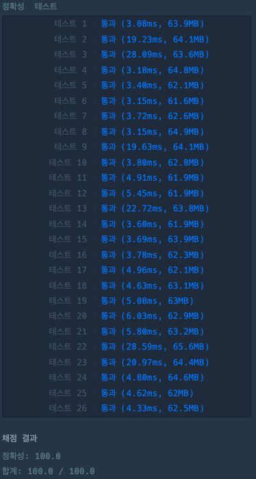
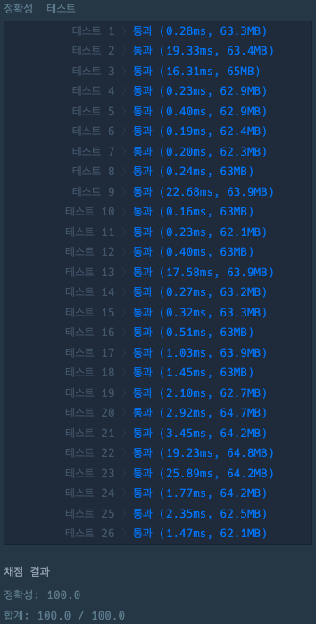

# 신규 아이디 추천

### 정답 코드 1 : 성능 개선 전

```kotlin
class Solution {

    fun solution(new_id: String): String {
        var answer = new_id.lowercase() // 1단계: 소문자로 변환

        answer = answer.replace(Regex("[^-_.a-z0-9]"), "") // 2단계: 허용되지 않은 문자 제거
        answer = answer.replace(Regex("[.]{2,}"), ".") // 3단계: 연속된 마침표를 하나로 치환
        answer = answer.replace(Regex("^[.]|[.]$"), "") // 4단계: 처음과 끝의 마침표 제거

        if (answer.isEmpty()) { // 5단계: 빈 문자열이면 "a" 추가
            answer = "a"
        }

        if (answer.length >= 16) { // 6단계: 길이가 16자 이상이면, 첫 15자만 남기고 끝의 마침표 제거
            answer = answer.substring(0, 15).replace(Regex("[.]$"), "")
        }

        while (answer.length <= 2) { // 7단계: 길이가 2자 이하라면, 마지막 문자를 반복해서 길이 3까지 확장
            answer += answer.last()
        }

        return answer
    }
    
}
```

### 실행 결과 : 성능 개선 전



### 설명

> 정규 표현식  
> 특정한 규칙을 가진 문자열의 집합을 다루는 데 사용하는 형식 언어이다.  
> 다양한 프로그래밍 언어에서 문자열의 검색과 치환을 위해 정규 표현식을 지원한다.

Kotlin에서 Regex 객체를 반복적으로 생성하면 성능이 떨어질 수 있다.

특히 데이터가 많거나 정규식을 여러 번 호출하는 경우, 매번 정규식 객체를 생성하고 컴파일하면서 불필요한 리소스 소비가 발생한다.

```kotlin
answer = answer.replace(Regex("[^-_.a-z0-9]"), "") // 정규식 객체 매번 생성
answer = answer.replace(Regex("[.]{2,}"), ".") 
answer = answer.replace(Regex("^[.]|[.]$"), "")
```

이 코드는 내부적으로 java.util.regex.Pattern을 사용하지만, Kotlin에서는 Regex 객체가 캐싱되지 않고 반복 생성되며, 이 과정에서 정규식 컴파일 비용이 누적된다.

### Java와 Kotlin의 차이

-   Java : replaceAll 메서드는 내부적으로 Pattern.compile()을 호출하며, 정규식을 캐싱한다.
-   Kotlin : Regex 객체는 별도의 캐싱 없이 매번 새로운 객체를 생성한다. 이로 인해 반복 호출 시 성능이 저하된다.

이 문제를 해결하기 위해 정규식을 companion object에 선언하고 재사용하도록 수정했다.

### 정답 코드 2 : 성능 개선 후

```kotlin
class Solution {
    
    companion object {
        val regexAllowed = Regex("[^-_.a-z0-9]") // 허용되지 않은 문자 제거
        val regexDots = Regex("[.]{2,}")         // 연속된 마침표 제거
        val regexEdgeDots = Regex("^[.]|[.]$")  // 처음과 끝의 마침표 제거
        val trailingDotRegex = Regex("[.]$")    // 마지막 마침표 제거
    }

    fun solution(new_id: String): String {
        var answer = new_id.lowercase()

        answer = answer.replace(regexAllowed, "") // 2~4단계: 정규식을 캐싱한 객체로 처리
            .replace(regexDots, ".")
            .replace(regexEdgeDots, "")

        if (answer.isEmpty()) { // 5단계: 빈 문자열 처리
            answer = "a"
        }

        if (answer.length >= 16) { // 6단계: 길이 제한 및 끝 마침표 제거
            answer = answer.substring(0, 15).replace(trailingDotRegex, "")
        }

        while (answer.length <= 2) { // 7단계: 최소 길이 확장
            answer += answer.last()
        }

        return answer
    }
    
}
```

### 실행 결과 : 성능 개선 후



### 마무리

정규식 캐싱을 통해 약 40%의 성능 개선을 확인할 수 있었다.

작은 변환처럼 보이지만, 정규식 캐싱은 실제로 큰 차이를 만들어낼 수 있었다.

이번 문제를 통해 캐싱이 얼마나 중요한 성능 최적화 기법인지 다시 한번 확인할 수 있었다.
