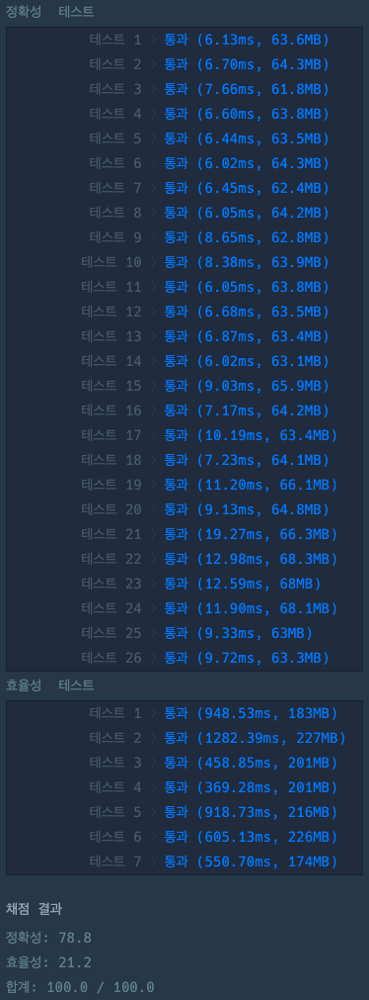

# 호텔 방 배정

### 정답 코드

```kotlin
import java.util.*

class Solution {
    private lateinit var parents: MutableMap<Long, Long>

    fun solution(k: Long, room_number: LongArray): LongArray {
        val answer = mutableListOf<Long>()

        // (MakeSet) 각 방을 자기 자신을 부모로 가지는 집합으로 초기화합니다.
        parents = mutableMapOf()
        for (room in room_number) {
            parents[room] = room
        }

        for (room in room_number) {
            // 방이 비어있는 경우
            if (parents[room] == room) {
                answer.add(room)
                union(room, room + 1)
            } else { // 방이 비어있지 않은 경우
                val root = find(room)
                union(root, root + 1)
                answer.add(root)
            }
        }

        return answer.toLongArray()
    }

    private fun find(a: Long): Long {
        if (parents[a] != a) {
            parents[a] = find(parents[a]!!)
        }
        return parents[a]!!
    }

    private fun union(a: Long, b: Long) {
        if (!parents.containsKey(b)) {
            parents[b] = b
        }

        val rootA = find(a)
        val rootB = find(b)
        parents[rootA] = rootB
    }
}
```

---

### 설명
이 문제는 Union-Find 자료구조를 활용해서 방 배정 문제를 효율적으로 해결한다.
경로 압축을 사용해 트리 깊이를 줄이고, 부모를 동적으로 갱신하면서 빠르게 다음 빈 방을 탐색한다.

각 방 요청마다 find와 union 연산을 사용해 시간 복잡도를 거의 상수 시간으로 유지한다.
덕분에 중복된 방 요청에도 빈 방을 빠르게 할당할 수 있다.

---

### 실행 결과


---

### 참고 자료  
취업과 이직을 위한 프로그래머스 코딩 테스트 문제 풀이 전략 : 자바 편
