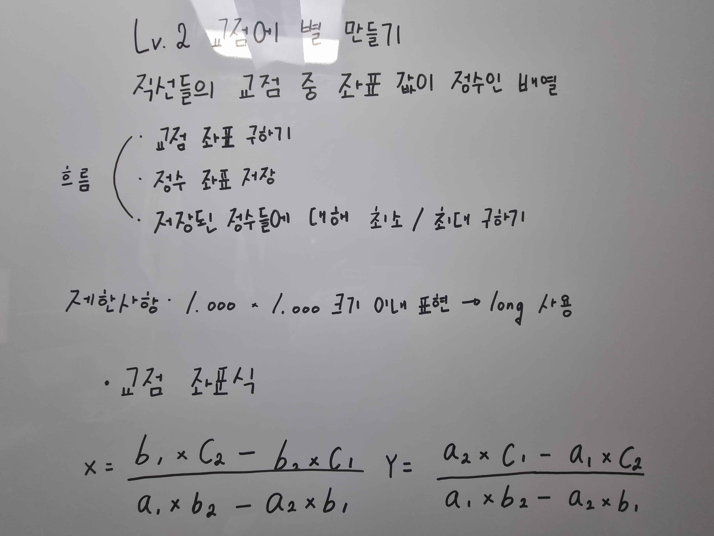
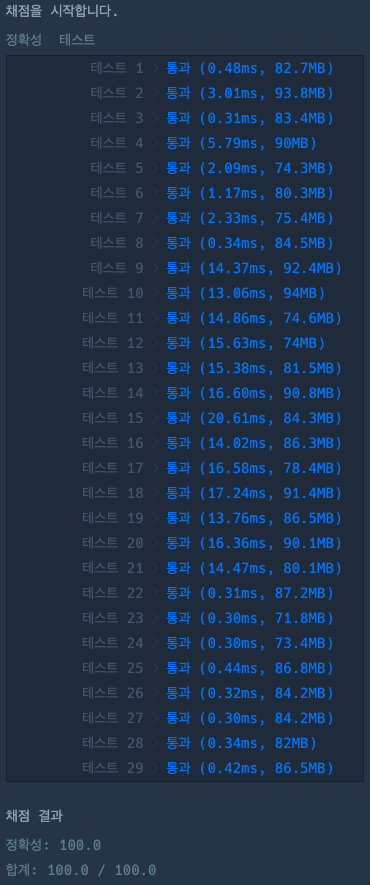

# 교점에 별 만들기

### 정답 코드

```java
import java.util.*;

class Solution {

    private static class Point {
        public final long x, y;

        private Point(long x, long y) {
            this.x = x;
            this.y = y;
        }
    }

    // 교점 좌표 구하기
    private Point intersection(long a1, long b1, long c1, long a2, long b2, long c2) {
        double x = (double) (b1 * c2 - b2 * c1) / (a1 * b2 - a2 * b1);
        double y = (double) (a2 * c1 - a1 * c2) / (a1 * b2 - a2 * b1);

        if (x % 1 != 0 || y % 1 != 0) return null;

        return new Point((long) x, (long) y);
    }

    // 저장된 정수 x, y 좌표의 최솟값 구하기
    private Point getMinimumPoint(List<Point> points) {
        long x = Long.MAX_VALUE;
        long y = Long.MAX_VALUE;

        for (Point p : points) {
            if (p.x < x) x = p.x;
            if (p.y < y) y = p.y;
        }

        return new Point(x, y);
    }

    // 저장된 정수 x, y 좌표의 최댓값 구하기
    private Point getMaximumPoint(List<Point> points) {
        long x = Long.MIN_VALUE;
        long y = Long.MIN_VALUE;

        for (Point p : points) {
            if (p.x > x) x = p.x;
            if (p.y > y) y = p.y;
        }

        return new Point(x, y);
    }

    public String[] solution(int[][] line) {

        List<Point> points = new ArrayList<>();

        for(int i = 0; i < line.length; i++) {
            for(int j = i + 1; j < line.length; j++) {
            Point intersection = intersection(
                    line[i][0], line[i][1], line[i][2],
            line[j][0], line[j][1], line[j][2]
            );

            if (intersection != null) {
                points.add(intersection);
            }
        }
        }

        Point minimum = getMinimumPoint(points);
        Point maximum = getMaximumPoint(points);

        int width = (int) (maximum.x - minimum.x + 1);
        int height = (int) (maximum.y - minimum.y + 1);

        // 2차원 배열 크기 정하기
        char[][] arr = new char[height][width];
        for (char[] row : arr) {
            Arrays.fill(row, '.');
        }

        for (Point p : points) {
            int x = (int) (p.x - minimum.x);
            int y = (int) (maximum.y - p.y);
            arr[y][x] = '*';
        }

        String[] result = new String[arr.length];
        for (int i = 0; i < result.length; i++) {
            result[i] = new String(arr[i]);
        }

        return result;
    }

}
```

---

### 설명


---

### 실행 결과


---

### 참고 자료
취업과 이직을 위한 프로그래머스 코딩 테스트 문제 풀이 전략 : 자바 편
