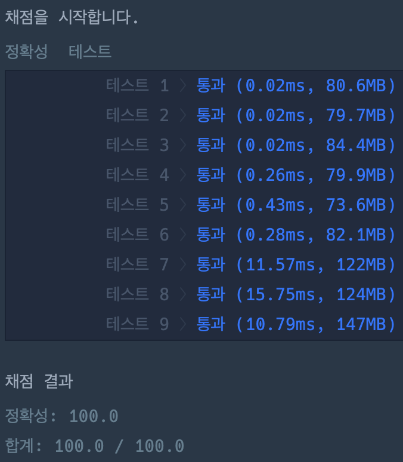
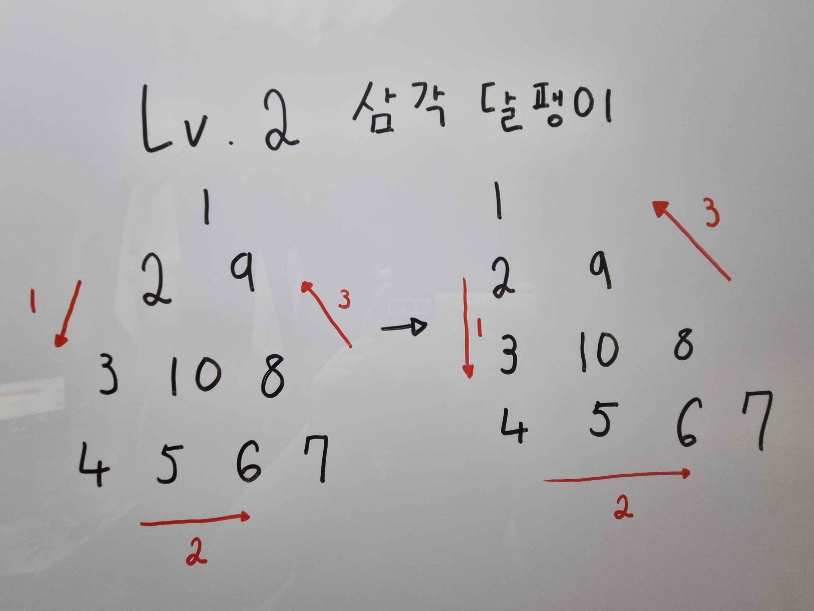
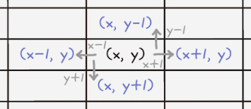
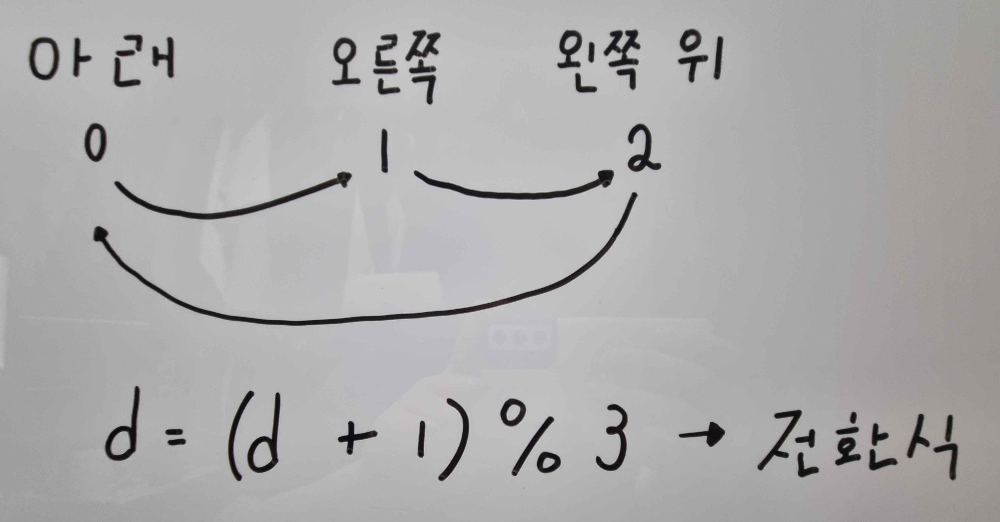
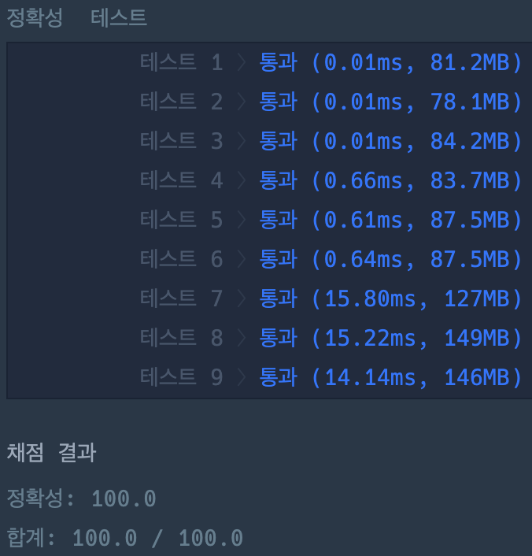

# 교점에 별 만들기

### 정답 코드 1 : 구조 개선 전

```java
class Solution {
    public int[] solution(int n) {
        int[][] triangle = new int[n][n];
        int x = 0;
        int y = 0;
        int v = 1;

        while (true) {
            // 아래로 이동
            while (true) {
                triangle[y][x] = v++;
                if (y + 1 == n || triangle[y + 1][x] != 0) break;
                y += 1;
            }
            if (x + 1 == n || triangle[y][x + 1] != 0) break;
            x += 1;

            // 오른쪽으로 이동
            while (true) {
                triangle[y][x] = v++;
                if (x + 1 == n || triangle[y][x + 1] != 0) break;
                x += 1;
            }
            if (triangle[y - 1][x - 1] != 0) break;
            x -= 1;
            y -= 1;

            // 왼쪽 위로 이동
            while (true) {
                triangle[y][x] = v++;
                if (triangle[y - 1][x - 1] != 0) break;
                x -= 1;
                y -= 1;
            }
            if (y + 1 == n || triangle[y + 1][x] != 0) break;
            y += 1;
        }

        int[] result = new int[v - 1];
        int index = 0;
        for (int i = 0; i < n; i++) {
            for (int j = 0; j <= i; j++) {
                result[index++] = triangle[i][j];
            }
        }

        return result;
    }
}
```

---

### 실행 결과 1 : 구조 개선 전


---

### 설명

이 문제에서는 삼각형을 표현해야 하며, 이를 2차원 배열로 나타내어 해결했다.  
문제의 조건인 반시계 방향으로 '달팽이 채우기'를 진행하기 위해, 방향을 아래 → 오른쪽 → 왼쪽 위 순으로 설정했다.

그러나 현재 코드에서는 모든 방향에 대한 수정을 직접 해야 하는 번거로움이 있다.  
이를 최소화하기 위해 dx와 dy를 활용하는 방법을 알아보자.


#### dx와 dy의 의미
- dx  
  x의 변화량
- dy  
  y의 변화량

즉, 특정 방향으로 이동할 때 좌표 값이 어떻게 변화하는지를 나타낸다.

#### 삼각 달팽이 문제에서의 dx, dy
|방향|아래|오른쪽|왼쪽 위|
|---|---|---|---|
|dx|0|1|-1|
|dy|1|0|-1|
이처럼 dx와 dy를 활용하면 방향별 좌표 이동을 간결하게 처리할 수 있다.

#### 방향 변수 d의 전환 과정


---

### 정답 코드 2 : 구조 개선 후
```java
class Solution {
    
    private static final int[] dx = {0, 1, -1};
    private static final int[] dy = {1, 0, -1};
    
    public int[] solution(int n) {
        int[][] triangle = new int[n][n];
        int v = 1;
        int x = 0;
        int y = 0;
        int d = 0;
        
        while (true) {
            triangle[y][x] = v++;
            int nx = x + dx[d];
            int ny = y + dy[d];
            if (nx == n || ny == n || triangle[ny][nx] != 0) {
                d = (d + 1) % 3;
                nx = x + dx[d];
                ny = y + dy[d];
                if (nx == n || ny == n || triangle[ny][nx] != 0) break;
            }
            x = nx;
            y = ny;
        }
        
        int[] result = new int[v - 1];
        int index = 0;
        for (int i = 0; i < n; i++) {
            for (int j = 0; j <= i; j++) {
                result[index++] = triangle[i][j];
            }
        }       
    
        return result;
    }
    
}
```

---

### 실행 결과 2 : 구조 개선 후


---

### 마무리
이번 문제를 풀면서 성능과 코드량 간의 트레이드오프를 경험했다.  
구조 개선 전 코드는 성능이 더 뛰어났지만, 코드량이 많았다.  
개선 후 코드는 코드량이 줄었지만, 가독성이나 유지보수성은 크게 달라지지 않았다.

이 과정을 통해, 상황에 따라 성능과 코드 간결함 사이에서 균형을 잡는 것이 중요하다는 점을 배울 수 있었다.

---

### 참고 자료
취업과 이직을 위한 프로그래머스 코딩 테스트 문제 풀이 전략 : 자바 편
