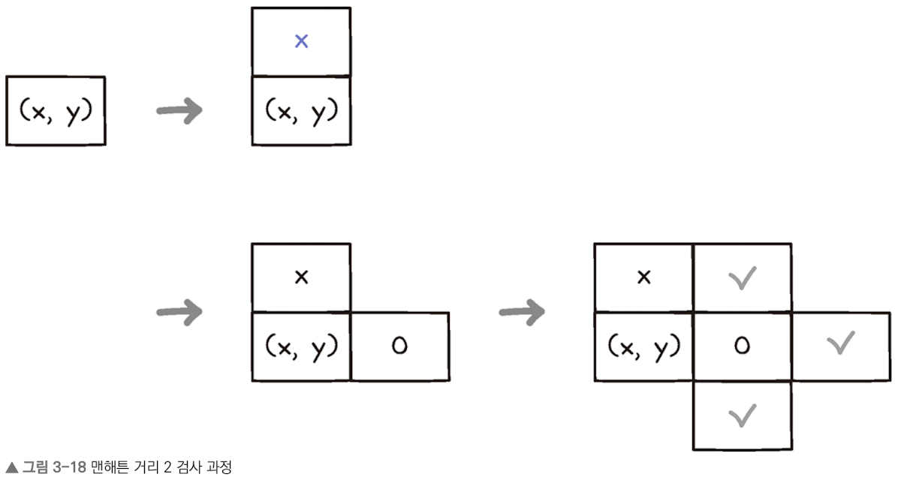
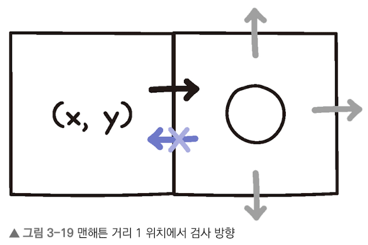
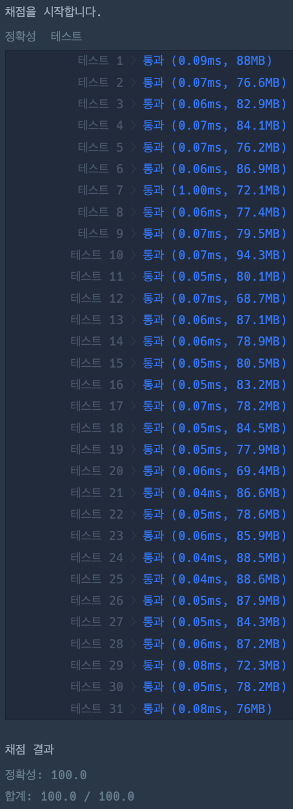

# 거리두기 확인하기

### 정답 코드

```java
class Solution {

    private static final int dx[] = {0, -1, 1, 0};
    private static final int dy[] = {-1, 0, 0, 1};
    
    private static final char PERSON = 'P';
    private static final char EMPTY = 'O';

    public int[] solution(String[][] places) {
        int[] answer = new int[places.length];
        for (int i = 0; i < answer.length; i++) {
            String[] place = places[i];
            char[][] room = new char[place.length][];
            for (int j = 0; j < room.length; j++) {
                room[j] = place[j].toCharArray();
            }
            if (isDistanced(room)) {
                answer[i] = 1;
            } else {
                answer[i] = 0;
            }
        }
        return answer;
    }
    
    private boolean isDistanced(char[][] room) {
        for (int y = 0; y < room.length; y++) {
            for (int x = 0; x < room[y].length; x++) {
                if (room[y][x] != PERSON) continue;
                if (!isDistanced(room, x, y)) return false;
            }
        }
        return true;
    }
    
    private boolean isDistanced(char[][] room, int x, int y) {
        for (int d = 0; d < 4; d++) {
            int nx = x + dx[d];
            int ny = y + dy[d];
            if (isOutOfBounds(room, nx, ny)) continue;
            switch (room[ny][nx]) {
                case PERSON: 
                    return false;
                case EMPTY:
                    if (isNextToVolunteer(room, nx, ny, 3 - d)) return false;
                    break;
            }
        }
        return true;
    }
    
    private boolean isNextToVolunteer(
        char[][] room, 
        int x, 
        int y, 
        int exclude
    ) {
        for (int d = 0; d < 4; d++) {
            if (d == exclude) continue;
            
            int nx = x + dx[d];
            int ny = y + dy[d];
            if (isOutOfBounds(room, nx, ny)) continue;
            if (room[ny][nx] == PERSON) return true;
        }
        return false;
    }
    
    private boolean isOutOfBounds(char[][] room, int x, int y) {
        return y < 0 || y >= room.length || x < 0 || x >= room[y].length;
    }

}
```

---

### 설명

> 맨해튼 거리란  
> 2차원 좌표계에서 두 점 사이의 거리를 직선 경로가 아니라 격자 이동으로 계산하는 방법이다.

<br/>


위 코드는 주어진 places 배열에

대한 거리두기 규칙을 준수하는지 확인하는 알고리즘이다.

이 알고리즘은 BFS(너비 우선 탐색) 방식을 활용하여,

맨해튼 거리 2 이내에서 규칙 위반 여부를 검사한다.

특히, 두 이미지(맨해튼 거리 1 검사, 거리 2 검사)를 참고하여 구현되었다.

---

### 실행 결과


---

### 참고 자료
취업과 이직을 위한 프로그래머스 코딩 테스트 문제 풀이 전략 : 자바 편
