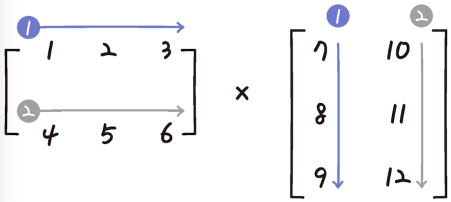
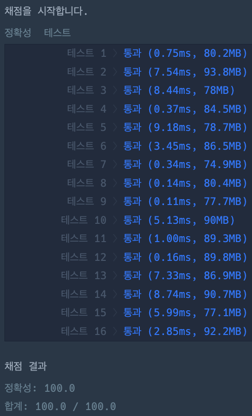

# 행렬의 곱셈

### 정답 코드

```java
class Solution {

    public int[][] solution(int[][] arr1, int[][] arr2) {
        int[][] arr = new int[arr1.length][arr2[0].length];
        for (int i = 0; i < arr.length; i++) {
            for (int j = 0; j < arr[i].length; j++) {
                arr[i][j] = 0;
                for (int k = 0; k < arr1[i].length; k++) {
                    arr[i][j] += arr1[i][k] * arr2[k][j];
                }
            }
        }
        return arr;
    }

}
```

---

### 설명

위 문제는 행렬 곱셈 알고리즘을 활용하여 풀이되었다.

---

### 실행 결과


---

### 참고 자료
취업과 이직을 위한 프로그래머스 코딩 테스트 문제 풀이 전략 : 자바 편
