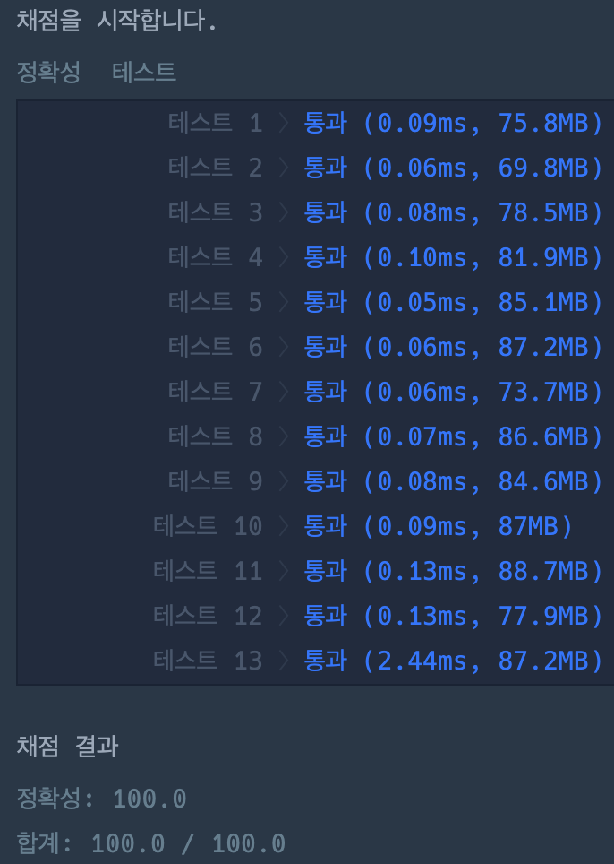

# 시저 암호

### 정답 코드

```java
public class Solution {

    public String solution(String s, int n) {
        StringBuilder builder = new StringBuilder();
        for (char c : s.toCharArray()) {
            builder.append(push(c, n));
        }
        return builder.toString();
    }

    private char push(char c, int n) {
        if (!Character.isAlphabetic(c)) return c;
        int offset = Character.isUpperCase(c) ? 'A' : 'a';
        int position = c - offset;
        position = (position + n) % ('Z' - 'A' + 1);
        return (char) (offset + position);
    }

}
```

---

### 설명
1.  입력 문자열의 모든 문자에 대해 반복
2.  알파벳이 아닌 경우 문자를 그대로 이어 붙이기
3.  알파벳인 경우 n만큼 밀어 이어 붙이기

---

### 실행 결과


---

### 참고 자료
취업과 이직을 위한 프로그래머스 코딩 테스트 문제 풀이 전략 : 자바 편
