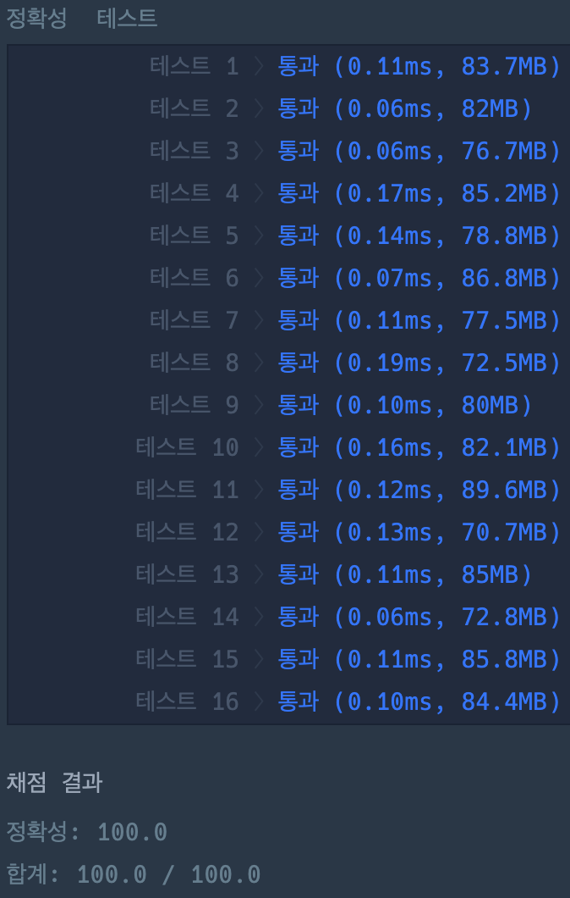

# 이상한 문자 만들기

### 정답 코드

```java
public class Solution {

    public String solution(String s) {
        StringBuilder builder = new StringBuilder();
        boolean toUpper = true;

        for (char c : s.toCharArray()) {
            if (!Character.isAlphabetic(c)) {
                builder.append(c);
                toUpper = true;
            } else {
                if (toUpper) {
                    builder.append(Character.toUpperCase(c));
                } else {
                    builder.append(Character.toLowerCase(c));
                }
                toUpper = !toUpper;
            }
        }

        return builder.toString();
    }

}
```

---

### 설명
1.  문자열의 모든 문자에 대한 반복  
    문자열의 각 문자를 하나씩 처리한다.
2.  문자가 공백 문자일 경우  
    공백 문자를 그대로 이어붙인다.  
    다음 등장하는 알파벳 문자는 대문자로 처리한다.
3.  문자가 공백 문자가 아닌 경우  
    알파벳 문자의 대·소문자를 변경하여 이어붙인다.  
    현재 문자가 대문자이면 소문자로, 소문자이면 대문자로 변환한다.  
    다음 등장하는 알파벳의 대·소문자는 현재 변환된 문자와 반대로 처리한다.
4.  구성된 문자열 반환  
    위 규칙에 따라 처리된 문자열을 반환한다.

---

### 실행 결과


---

### 참고 자료
취업과 이직을 위한 프로그래머스 코딩 테스트 문제 풀이 전략 : 자바 편
