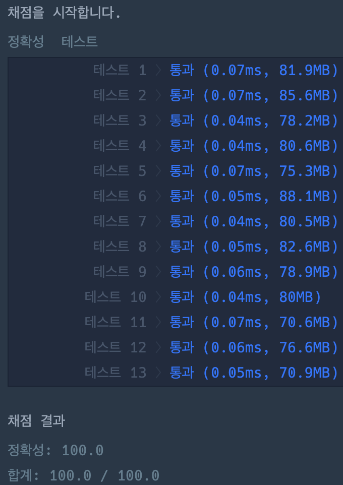

# 자연수 뒤집어 배열로 만들기

### 정답 코드

```java
public class Solution {

    public int[] solution(long n) {
        String str = Long.toString(n);
        String reversed = new StringBuilder(str).reverse().toString();
        char[] arr = reversed.toCharArray();

        int[] result = new int[arr.length];
        for (int i = 0; i < result.length; i++) {
            result[i] = arr[i] - '0';
        }
        return result;
    }

}
```

---

### 설명
1.  입력받은 숫자를 문자열로 변환한다.
2.  문자열을 뒤집는다.
3.  뒤집힌 문자열을 문자의 배열로 변환한다.
4.  배열의 각 문자를 정수로 변환한다.

---

### 실행 결과


---

### 참고 자료
취업과 이직을 위한 프로그래머스 코딩 테스트 문제 풀이 전략 : 자바 편
