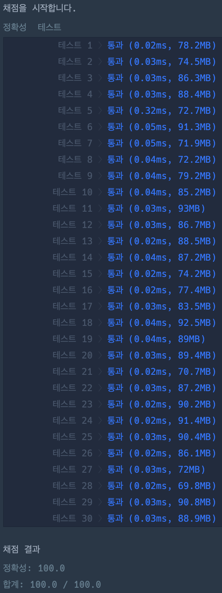

# 3진법 뒤집기

### 정답 코드

```java
class Solution {
    boolean solution(String s) {
        int ps = 0;
        int ys = 0;
        
        for (char c : s.toCharArray()) {
            switch(c) {
                case 'p', 'P' -> ps++;
                case 'y', 'Y' -> ys++;
            }
        }
        
        return ps == ys;
    }
}
```

---

### 설명
1. 문자열을 모두 소문자로 변환
2. "p"의 개수 세기
   - 문자열에 등장하는 모든 "p"를 빈 문자열 ""로 치환
   - 원본 문자열과 변환된 문자열의 길이 차이가 p의 개수
3. 2와 같은 방식으로 y의 개수 세기
4. 구한 p의 개수와 y의 개수 비교

---

### 실행 결과


---

### 참고 자료
취업과 이직을 위한 프로그래머스 코딩 테스트 문제 풀이 전략 : 자바 편
