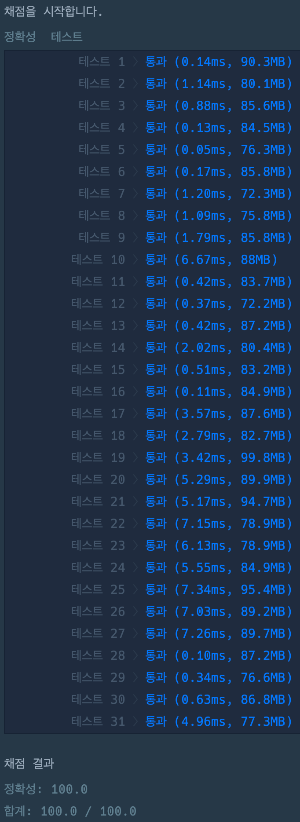

# 문자열 압축

### 정답 코드

```java
import java.util.ArrayList;
import java.util.Collections;
import java.util.List;

public class Solution {

    public int solution(String s) {
        int min = Integer.MAX_VALUE;
        for (int length = 1; length <= s.length(); length++) {
            int compressed = compress(s, length);
            if (compressed < min) {
                min = compressed;
            }
        }
        return min;
    }
    
    private int compress(final String source, final int length) {
        StringBuilder builder = new StringBuilder();
        
        String last = "";
        int count = 0;
        for (String token : split(source, length)) {
            if (token.equals(last)) {
                count++;
            } else {
                if (count > 1) builder.append(count);
                builder.append(last);
                last = token;
                count = 1;
            }
        }
        if (count > 1) builder.append(count);
        builder.append(last);
        
        return builder.length();
    }
    
        private List<String> split(final String source, final int length) {
        List<String> tokens = new ArrayList<>();
        for (int startIndex = 0; startIndex < source.length(); startIndex += length) {
            int endIndex = startIndex + length;
            if (endIndex > source.length()) endIndex = source.length();
            tokens.add(source.substring(startIndex, endIndex));
        }
        return Collections.unmodifiableList(tokens);
    }
    
}
```

---

### 설명
1. 1부터 입력 문자열 s의 길이만큼 자를 문자열의 길이를 설정하며 반복한다.
2. 설정된 길이만큼 문자열을 잘라 낸 token의 배열 생성한다.
3. 문자열을 비교하며 token의 배열을 하나의 문자열로 압축한다.
4. 1 ~ 3 과정으로 압축된 문자열 중 가장 짧은 길이 반환한다.

---

### 실행 결과


---

### 참고 자료 :
취업과 이직을 위한 프로그래머스 코딩 테스트 문제 풀이 전략 : 자바 편
