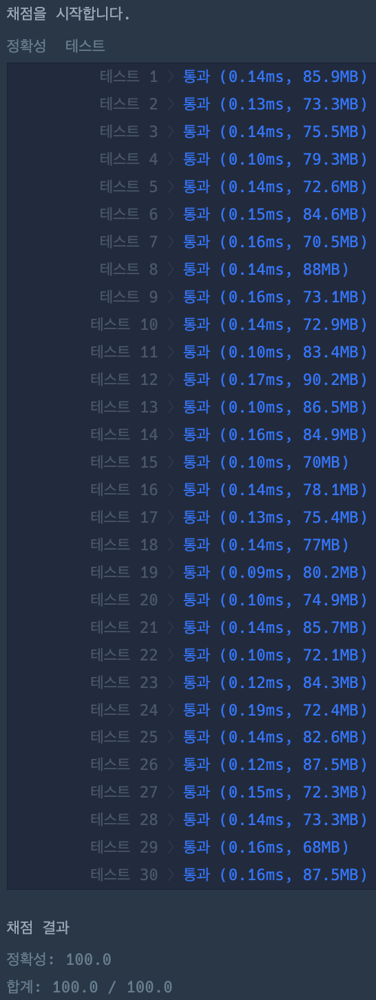

# 문자열 다루기 기본

### 정답 코드

```java
class Solution {

    public boolean solution(String s) {
        return s.matches("[0-9]{4}|[0-9]{6}");
    }

}
```

---

### 설명
우선 문자열이 숫자로만 구성되어야 하므로 [0-9]를 이용할 수 있다.
여기에 길이가 4 또는 6이라는 조건을 추가하면 [0-9]{4}|[0-9]{6}과 같은 정규표현식이 만들어진다.
이를 이용하여 문자열을 검사하고 그 결과값을 반환하면 된다.

---

### 실행 결과


---

### 참고 자료 :
취업과 이직을 위한 프로그래머스 코딩 테스트 문제 풀이 전략 : 자바 편
