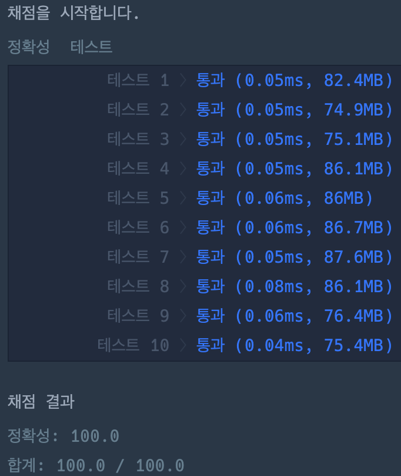

# 숫자 문자열과 영단어

### 정답 코드

```java
class Solution {

   private static final String[] ENGLISH_WORDS = {
           "zero", "one", "two", "three", "four",
           "five", "six", "seven", "eight", "nine"
   };

   public int solution(String s) {
      for(int i = 0; i < words.length; i++) {
         s = s.replace(ENGLISH_WORDS[i], Integer.toString(i));
      }

      return Integer.parseInt(s);
   }

}
```

---

### 설명
1. 각 인덱스 값에 해당하는 영단어가 저장되어 있는 영단어 문자열 배열을 구성
2. 영단어 배열을 순회하며 입력 문자열에 등장하는 모든 영단어를 치환한 문자열 생성
3. 변환된 문자열을 정수로 변환한 후 반환

---

### 실행 결과


---

### 참고 자료 :
취업과 이직을 위한 프로그래머스 코딩 테스트 문제 풀이 전략 : 자바 편
