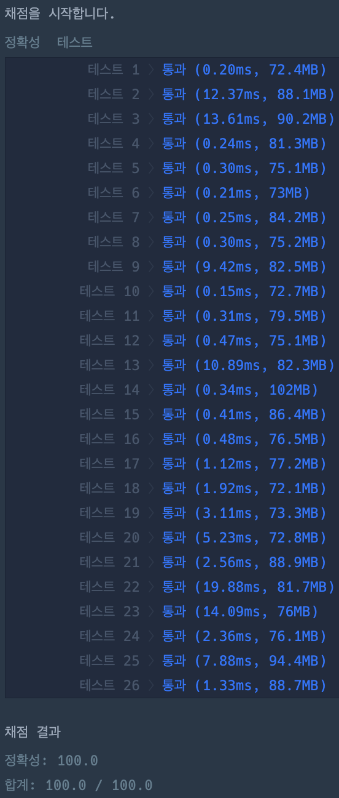

# 신규 아이디 추천

### 정답 코드

```java
class Solution {

    public String solution(String newId) {
        newId = newId.toLowerCase();
        newId = newId.replaceAll("[^a-z0-9\\-_.]", "");
        newId = newId.replaceAll("\\.+", ".");
        newId = newId.replaceAll("^\\.|\\.$", "");

        if (newId.isEmpty()) newId = "a";

        if (newId.length() >= 16) {
            newId = newId.substring(0, 15);
            newId = newId.replaceAll("\\.$", "");
        }

        while (newId.length() < 3) {
            newId += newId.charAt(newId.length() - 1);
        }

        return newId;
    }

}
```

---

### 설명
1. 모든 대문자를 소문자로 변환
2. 허용된 문자 이외 제거
3. 연속된 마침표(.)를 하나로 변경
4. 문자열 앞위의 마침표 제거
5. 빈 문자열일 경우 "a"로 대체
6. 문자열 길이 조정 (최대 15자)
7. 문자열 길이 조정 (최소 3자)

---

### 실행 결과


---

### 참고 자료 :
취업과 이직을 위한 프로그래머스 코딩 테스트 문제 풀이 전략 : 자바 편
