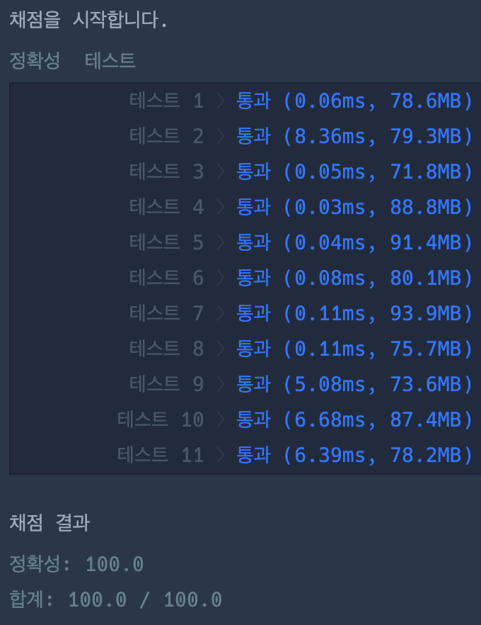

# 이진 변환 반복하기

### 정답 코드

```java
class Solution {

    public int[] solution(String s) {
        int loop = 0;
        int removed = 0;
        while (!s.equals("1")) {
            int zeros = countZeros(s);
            loop += 1;
            removed += zeros;

            int ones = s.length() - zeros;
            s = Integer.toString(ones, 2);
        }

        return new int[] {loop, removed};
    }

    private int countZeros(final String s) {
        int zeros = 0;
        for (char c : s.toCharArray()) {
            if (c == '0') zeros++;
        }
        return zeros;
    }

}
```

---

### 설명
1. 검사하는 문자열이 "1"이 될 때까지 반복
   - 문자열에 포함된 0의 개수 세기
      - 0의 개수와 제거 횟수 누적
   - 나머지 1의 개수를 사용해서 2진법으로 변환하여 1부터 반복
2. 누적된 제거 횟수와 0의 개수를 배열로 반환

---

### 실행 결과


---

### 참고 자료 :
취업과 이직을 위한 프로그래머스 코딩 테스트 문제 풀이 전략 : 자바 편
